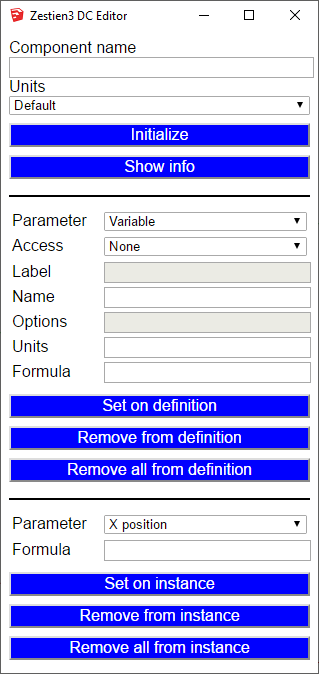

# Dynamic Component Editor

This plugin has only be tested on my Windows 10 system, running **Sketchup 2017 Make**. So I don't know if it will work on any other OS or Sketchup
version. The software is as is, no guarantees. It does **NOT** need the Pro version to work, so also the free version of Sketchup can be used to
create Dynamic Components using this plugin.

I don't know that much about Dynamic Components myself, so this plugin might implement some features I don't understand myself. Some properties
(like material, Scale tool, Hidden onClick and Copies) have not been tested so they might not work. I need to play a bit with it to discover how it
all works.

To be able to use Dynamic Components in Sketchup, you need to install the **Dynamic Components** extension from Sketchup.

### How do I install the plugin?

I assume you know a bit on how to use Dynamic Components. If not, you might want to use Google or YouTube to get some info on this subject.

Copy the dc_editor.rb file and the dc_editor_rb folder to your **%APPDATA%\SketchUp\SketchUp 2017\SketchUp\Plugins** folder.
After that, if you startup Sketchup, under the Extensions menu there is a new entry called **DC Editor**.

This will open a dialog, in which you can edit the DC properties for components in your model.

Components in your model consist of a definition and the instances created for that definition.
The Component Definition needs a name, so the sub-components can reference it. It looks like sub components can only reference their parent component.
Components also need to know if their units are in cm, mm or inches. You can select one of them. After this you can initialize the Component
Definition with this information.

The **Show info** button shows the info of the selected components in the **Ruby Console** which can be opened using the **Window** menu. The info is
a bit cryptic, it is implemented for debugging purposes. You can however also show info from dynamic components created using the Sketchup PRO
version, which might teach you a bit more on how to create Dynamic Components.

On the Component Definition you can add a variable which sub-components can reference to change their properties. These variables can be given a value
using the **Component Options** icon on the **Dynamic Components** toolbar.
- What control is used in this dialog is specified by the **Access** attribute.
- The label in this dialog is specified in the **Label** attribute.
- The name of the variable is specified in the **Name** attribute.
- The **Options** attribute is only used for variables shown as a **List**.
- I don't know what the **Units** attribute is used for.
- The **Formula** attribute is used to process the variables using some functions. More info can be found
  [here](https://help.sketchup.com/en/sketchup/dynamic-components-math-function-examples)
- There are also some predefined properties of components you could change, but it often doesn't make sense to set them on the Component Definition.
  But they can be found under the **Parameter** attribute

On the Component Instance you can decide what property is determining the Dynamic behavior. You can set them in the last part of the dialog.